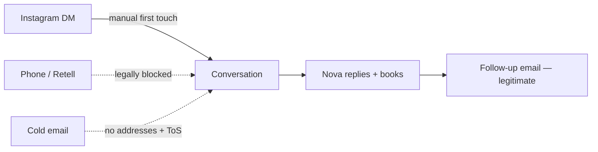

# 🧭 Active Context

> [!abstract] Read this first
> Session-start file (CLAUDE.md rule). Last full refresh **2026-07-31**.
> Verify against production before trusting anything here — if a doc and the
> running system disagree, **the system wins**, and you fix the doc.

---

## 🚦 Status at a glance

| | |
|---|---|
| **Build live** | `0c9ddfac6e6c` · `db: ok` · `memory: ok` |
| **Leads in production** | **0** ⚠️ |
| **Tests** | 750 passing |
| **Open PRs** | [#124](https://github.com/markcosker2-dev/orova-nova/pull/124) — never email a guessed address |
| **Conversations ever** | **0** |

> [!danger] The number that matters
> **0 calls. 0 meetings. 0 prospect conversations, ever.**
> Discovery is solved. ~29,000 West Coast contractors are reachable for free.
> **Nothing in the codebase is the constraint any more.**

---

## 🎯 Identity — HermesClaw is an SDR

> [!info] Owner decision, 2026-07-14/15 — FINAL ([[0006-sdr-refocus|ADR-0006]])
> HermesClaw's sole purpose is to be the best autonomous AI SDR for OROVA.
> **North-star metric: booked meetings.**
> Repo is `app/ + knowledge/ + vault/ + mission-control/ + scripts/ + tests/`.
> Rejected channels on legal grounds: LinkedIn automation (ToS), cold SMS (TCPA).

---

## 👥 ICP — ranked by deal economics

> [!success] [[0012-icp-rerank-and-pilot-pricing|ADR-0012]] — the qualifying test
> *Does ONE extra closed deal per month more than cover the ~$6.5–7.5K all-in cost?*
>
> 1. **Custom home builders / high-end remodelers — LEAD.** One $100K+ job grosses $20–50K → pays 4–7 months of retainer.
> 2. **Med spas / aesthetics.** 1–2 extra patients/mo covers it; most-proven Meta vertical.
> 3. **Luxury RE top producers only.**
>
> **Opportunistic:** exotic/luxury auto. Economics work, but a $200K buyer rarely starts on a Meta lead form.

> [!failure] Disqualify on sight
> General auto repair (~$400/job → ~16 jobs/mo to break even) · franchised
> new-car dealers (OEM co-op mandates) · already under agency contract.
>
> **Now enforced in code** — `lead_validator.off_icp_trade_reason` checks
> vertical *and* business name (PR #119, after a live bypass).

> [!warning] Geography — corrected 2026-07-31
> The ICP is the **whole West Coast**, not WA. Earlier work anchored on
> Washington because that's where the free registry API was — tooling drove
> targeting, which is backwards. **California is the #1 geography.**
>
> | Metro | Contractors on Yelp |
> |---|---|
> | **Los Angeles** | **20,000** |
> | Portland | 3,600 |
> | Seattle | 3,300 |
> | San Diego | 2,400 |

> [!quote] Honest caveat
> This ranking is inference from deal economics, **not customer evidence**.
> Zero prospect conversations have happened. ~20 real conversations settle it.

---

## 🩹 Positioning — sell the painkiller

> [!tip] [[0013-painkiller-positioning-and-real-competition|ADR-0013]]
> **Never sell growth ("more leads")** — that's a vitamin, and it loses to
> Angi's ~$400 price anchor at 16×. **Sell the deadline.**
>
> - **Pain A — The Gap:** *"When your crew finishes the job they're on, what's next?"* → P1 or P2
> - **Pain B — The Wasted Saturday:** *"You'll never drive 40 minutes to a tire-kicker again."* → **P2 ONLY** — P1 makes this pain worse
>
> **Diagnose before prescribing.**

> [!info] The real enemy is inertia
> Not another agency — he's worked his way for 15 years at zero switching cost.
> Only a deadline he already feels beats it. Hence the hard qualifiers:
> **backlog <8 weeks + W-2 crew on payroll.**
>
> **Never argue price** — change the unit from cost-per-lead to
> **cost-per-idle-week-of-payroll**.
>
> **One differentiator only:** every lead phoned + AI-qualified in minutes, so he
> only drives to real buyers. Never pitch "we're AI-operated" — worthless to him.
> *(Different from honestly answering "are you a bot?" — always do that.)*

---

## 📡 Channel status

> [!success] ✅ INSTAGRAM — open, legal, free, unblocked
> The only channel available today.
> **DM #1 is manual** — the API physically cannot initiate threads
> (`INSTAGRAM_SEND_TEXT_MESSAGE`: *"Cannot initiate new DM threads"*).
> Everything after it can be automated. See [[instagram-outreach-plan-2026-07-30]]
> for 10 qualified targets and drafts, and [[ig-reply-agent-scheduled-task-prompt]].
>
> ⚠️ `orova.co` is currently **PRIVATE** — the messaging API returns empty for
> personal accounts. Must be Business/Creator + public before any of this works.

> [!danger] ⛔ PHONE — built, merged, and NOT safe to enable
> Lane merged in PR #123 and **inert** (`CALLS_AUTOPILOT=0`). Do not flip it.
> - **RCW 80.36.400** appears to bar automated commercial solicitation in WA
>   outright — no B2B exemption, no consent cure, per-se CPA violation.
> - **TCPA §227(b)** — $500–1,500/call for artificial voice to any *wireless*
>   number, **no B2B exemption**. Licence records list mobiles without saying which.
> - **`is_dnc_registered` fails open and is unconfigured** → zero registry protection.
> - **No recording announcement** — WA is two-party consent (RCW 9.73.030).
>
> **Open question worth one lawyer hour:** is a *two-way conversational* agent an
> "ADAD"/"artificial voice message" at all, or do those terms reach only one-way
> prerecorded announcements? That answer unlocks or shelves the channel.

> [!failure] ❌ COLD EMAIL — deferred, and not for the reason we thought
> - **0 of 8 providers permit cold outreach**, including AgentMail's own ToS §10.
> - **No valid addresses.** Licence registries have none; Yelp has none.
> - The `550 5.4.1` bounces were **invalid recipients** (Directory-Based Edge
>   Blocking = "no such mailbox"), **not** deliverability. `_guess_email`
>   fabricated them. PR #124 stops them ever being emailed again.
> - A shared domain **can** pass SPF/DKIM/DMARC — verified by DNS on
>   `agentmail.to`. "No domain means no auth" is false.
>
> **Post-call follow-up email is NOT cold email** — solicited, transactional,
> ToS-clean, free on the existing inbox. **Phone/DM manufactures the consent
> that makes email legitimate.** Sequence the channels; don't choose.

---

## 🔍 Discovery — solved, and cheaper than expected

> [!success] Sources that work today, all free
> | Source | Gives | Volume |
> |---|---|---|
> | **Yelp** (via Composio, no key, no approval) | business, phone, rating, review count, category | ~29,000 West Coast |
> | **WA L&I** (`data.wa.gov`, Socrata) | **owner name**, phone, address | ~4,280 on-ICP |
> | **OR CCB** (`data.oregon.gov`, Socrata) | owner name 95.9%, phone 100% | 56,087 active |
> | **CA CSLB** | free CSV incl. *personnel* file — no API | — |

> [!warning] Two corrections to [[0014-licence-registries-as-the-discovery-source|ADR-0014]]
> 1. **"6,249 on-ICP rows" overcounts.** Specialty `GENERAL` ≠ general contractor —
>    that bucket is full of landscapers, window cleaners, drywall, tile and
>    one-person handymen. With licence *type* + a name filter: **~4,280**.
> 2. **Yelp is NOT a dead end.** ADR-0014 listed it as "free tier ambiguous,
>    needs approval". It is live via Composio with **no key, no approval, no
>    payment** — and it supplies the business-size proxy the ADR called unsolved.

> [!question] The remaining gap — emails
> Every source gives a phone and withholds the email; that's what data vendors
> sell. **The fix is seam 2:** resolve a website → scrape the *published* contact
> address. Nova already scrapes well (`_scrape_website`, 7 pages, validated).
> Only the name→website step is missing. **This also unblocks California**, since
> the same crawl yields the owner name CA has no registry API for.

---

## 🔴 The blocking action

> [!danger] It is not code. It has not been code for weeks.
> 1. **`orova.co` → Business/Creator + public**, 3 posts. *(2 min + 20 min)*
> 2. **Send 5 Instagram DMs** from [[instagram-outreach-plan-2026-07-30]]. *(10 min)*
> 3. Bring back what they said. **≥8/20 positive = the ICP is real; ≤3 = switch to med spas.**
>
> On 2026-07-24 the instruction was written down: *"No further positioning or
> targeting work before those 20 calls."* Since then: 20+ PRs, zero conversations.

---

## 🛠️ Owner actions — only Mark can do these

> [!todo] In priority order
> 1. **Re-auth Google Drive.** Production is at **0 leads** because restore fails
>    `invalid_grant` and the Sheets fallback restored 0/4. **Better fix:** delete
>    `GOOGLE_REFRESH_TOKEN`/`CLIENT_ID`/`CLIENT_SECRET` from Render so
>    `_get_drive_service` falls through to the **service account**
>    (`GOOGLE_CREDENTIALS_JSON`) — service accounts never expire. Otherwise the
>    OAuth token dies every 7 days (Testing-mode publishing status).
> 2. **Set `CAL_COM_EVENT_SLUG`.** Free, ~10 min. **All three booking-link vars are
>    unset**, so a hot reply on *any* channel has no link to send. Blocks every meeting.
> 3. **`orova.co` → Business/Creator + public.**
> 4. **One WA consumer-protection lawyer hour** on the ADAD/§227(b) question.
> 5. **Keep `CALLS_AUTOPILOT=0`** until 4 comes back.

---

## ✅ Shipped 2026-07-29 → 07-31

| PR | What |
|---|---|
| #118 | Outreach safety gates, config contract, CAN-SPAM fail-closed |
| #119 | ICP gate reads business **name**, not just vertical (live bypass) |
| #120 | WA L&I licence registry as a discovery source (ADR-0014 seam 1) |
| #121 | ADR-0014 corrections + phone-lane gap recorded |
| #122 | Telegram alert debounce — Lane 7 was paging the same message 12×/day |
| #123 | Phone-first lane (merged, **inert**) |
| #124 | **Open** — never email a pattern-guessed address |

---

## 🚧 Standing constraints — don't "fix" these

> [!warning]
> **$0 pre-revenue** · **Render free tier**: 512 MB, ephemeral disk (deploys wipe
> SQLite), no browser, no outbound SMTP, 25s enrichment ceiling ·
> **`httpx==0.27.2` pinned** · **TCPA**: published business lines only, never
> personal cells · outreach approval-gated unless `*_AUTOPILOT=1` · ads/spend
> always human-approved · **never fabricate** — no invented leads, case studies,
> or portfolio work.

---

## 🔗 Linked

[[project-brief]] · [[business-model]] · [[system-patterns]] · [[traction-playbook]]
· [[progress]] · [[profitability-plan]]
· [[session-2026-07-30-discovery-shipped-phone-lane-gap]] — latest session
· [[instagram-outreach-plan-2026-07-30]] — the 10 targets + drafts
· [[ig-reply-agent-scheduled-task-prompt]] — the reply automation
