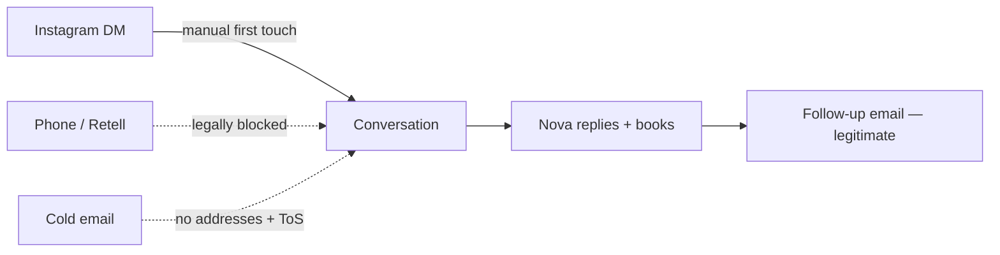

# 🧭 Active Context

> [!abstract] Read this first
> Session-start file (CLAUDE.md rule). Last full refresh **2026-07-31**.
> Verify against production before trusting anything here — if a doc and the
> running system disagree, **the system wins**, and you fix the doc.

> [!warning] Corrected 2026-08-15 — two "open" defects were fixed weeks ago
> This file had drifted two weeks against `main`. Flagged by an external
> read-only audit and **re-verified here against the code and the live
> instance** before being written down:
>
> - **`database is locked`** — fixed. `_db_base.py:257-258` and `:269-270` set
>   `PRAGMA journal_mode=WAL` and `busy_timeout=5000` on every pooled
>   connection.
> - **`no such table: events`** — fixed. `event_log.py:26` creates it on boot.
>   (Note the SSoT table in CLAUDE.md still calls the event log aspirational
>   for pipeline state; the TABLE exists, but Sheets still drives the
>   approval→call state machine. Both things are true.)
> - **Tests: 1368 passing**, up from the 750 recorded here. Knowledge gate
>   clean.
> - **`CALLS_AUTOPILOT=0` still enforced.** The WA TCPA / RCW 80.36.400
>   question below is still unresolved and calling is still gated.
>
> **Not carried over from the audit:** it also reported "6/13 capabilities
> configured" from a *local* boot with no `.env`. That measures the auditor's
> laptop, not Render — an app booted without env vars reports missing
> capabilities by construction. Production behaviour contradicts at least one
> item on that list: the boot log shows `✅ Telegram webhook registered` and
> the hunt lane logs `suppressing duplicate Telegram report`. **The real
> production capability report only prints at boot and had rotated out of the
> 100-line buffer**, so it is genuinely unverified either way — which is why
> it is not recorded here as fact. `CAL_COM_EVENT_SLUG` being unset IS
> confirmed independently: `get_booking_link()` returns `""`.

---

> [!tip] Check state with one command, not fifteen
> `python scripts/nova.py` prints live status + today's call sheet.
> `nova.py logs --errors` · `nova.py config` · `nova.py deploy` · `nova.py leaks`
> · `nova.py gates`. It asks production rather than inferring, which is the
> rule this file keeps having to re-learn. Anything below that disagrees with
> the tool is stale — **the system wins, and you fix the doc.**

## 🚦 Status at a glance

| | |
|---|---|
| **Build live** | `12fdf488975b` · `db: ok` · `memory: ok` (verified 2026-08-21) |
| **Leads in production** | **51** · 43 sole operators · 42 with verified cover · 51 with a phone · 13 with an email |
| **Tests** | 1417 exist · **CI green on Linux** · a full local Windows run gives 1407 pass / 10 order-dependent failures (all pass in isolation) |
| **Repo** | **PRIVATE** — restored 2026-08-21 |
| **Open PRs** | #182 — vault redaction + burned-key blocklist |
| **Conversations ever** | **0** |

> [!danger] The number that matters
> **0 calls. 0 meetings. 0 prospect conversations, ever.**
> Discovery is solved. ~29,000 West Coast contractors are reachable for free.
> **Nothing in the codebase is the constraint any more.**

> [!important] State changes — read before acting
> - **Repo visibility: SETTLED — it stays PUBLIC.** See
>   [[0016-the-repo-stays-public|ADR-0016]]. The repo is connected to Mark's
>   **Make.com** scenarios. It was flipped private→public three times because
>   nobody ever wrote the reason down; the reason is now recorded, so **do not
>   change visibility.** Public is the intended state.
>   Consequence to act on, not to re-argue: history and merged PR diffs are
>   world-readable, so any credential ever committed is permanently burned and
>   prospect PII in old diffs stays reachable. Both accepted knowingly.
> - **The flip back was 2026-08-15, not 2026-08-20** — about 2½ hours after it
>   went private, dated from GitHub event ids (the `PublicEvent.created_at`
>   field lies; it echoes the repo creation date). `2026-08-20` was when it was
>   noticed. Full working in
>   [[2026-08-21-a-redaction-that-leaves-the-recipe]].
> - **`DASHBOARD_API_KEY` — ROTATED 2026-08-21. Closed.** It had been in
>   plaintext in 7 tracked vault files on the public repo (the current tree, not
>   just history), one of them noting that it worked. #182 redacted it,
>   blocklisted it, and removed the sentence explaining how to derive it from
>   the previous key. The value itself was then replaced in Render and verified:
>   new key 200 on `/api/leads`, `/api/agents`, `/api/booking_link`; **old key
>   403**; unauthenticated 403. The old value stays in `BURNED_LITERALS`
>   forever — it is in 28 commits of public history and nothing can remove it.
> - Prospect PII cleaned in #172 was still reachable
>   in older commits and in merged PR diffs (a history rewrite does not touch
>   PR diffs). Private gates all three at once and is reversible. Verified
>   unauthenticated: old blobs and PR file views 404. No Support ticket needed.
> - **CodeQL: the ruff gate replaced it, but CodeQL itself is still running
>   and now FAILS on every push to `main`.** #177 deleted the workflow file and
>   that was not enough — this is GitHub **default setup**, a dynamic workflow
>   at `dynamic/github-code-scanning/codeql` with no file in the repo. On a
>   private repo without GHAS the analysis cannot complete, and the REST
>   endpoint to disable it returns `403`. **Only Mark can clear it:** Settings →
>   Code security → Code scanning → Default setup → Disable. Until then `main`
>   carries a permanently red check, which is the exact failure mode
>   `check_secrets.py` was written to avoid.
>   The replacement gate is narrow on purpose (exec / eval / pickle /
>   yaml.load / shell / os.system / string-built SQL): the full bandit ruleset
>   reports 112 findings here and all 112 are false positives, as were CodeQL's
>   7. Also: Actions minutes are capped at 2,000/month.
> - **The Retell prompt was deployed** and now knows `{{crew_status}}`, which
>   `outbound_dialer.py` had been sending on every call since #161 while the
>   prompt said "ONLY THESE SIX EXIST". The Retell API updates a version IN
>   PLACE — **there is no rollback pin.**

---

## 🎯 Identity — HermesClaw is an SDR

> [!info] Owner decision, 2026-07-14/15 — FINAL ([[0006-sdr-refocus|ADR-0006]])
> HermesClaw's sole purpose is to be the best autonomous AI SDR for OROVA.
> **North-star metric: booked meetings.**
> Repo is `app/ + knowledge/ + vault/ + mission-control/ + scripts/ + tests/`.
> Rejected channels on legal grounds: LinkedIn automation (ToS), cold SMS (TCPA).

---

## 👥 ICP — ranked by deal economics

> [!success] [[0012-icp-rerank-and-pilot-pricing|ADR-0012]] — the qualifying test
> *Does ONE extra closed deal per month more than cover the ~$6.5–7.5K all-in cost?*
>
> 1. **Custom home builders / high-end remodelers — LEAD.** One $100K+ job grosses $20–50K → pays 4–7 months of retainer.
> 2. **Luxury RE top producers only.**
>
> **Med spas removed 2026-08-09 — [[0015-med-spas-are-not-and-never-were-the-icp|ADR-0015]].**
> Owner: *"our ICP was never med spas."* ADR-0012 ranked them #2 from vertical
> economics, which was never the deciding input. Do not re-derive them.
>
> **Opportunistic:** exotic/luxury auto. Economics work, but a $200K buyer rarely starts on a Meta lead form.

> [!failure] Disqualify on sight
> General auto repair (~$400/job → ~16 jobs/mo to break even) · franchised
> new-car dealers (OEM co-op mandates) · already under agency contract.
>
> **Now enforced in code** — `lead_validator.off_icp_trade_reason` checks
> vertical *and* business name (PR #119, after a live bypass).

> [!warning] Geography — corrected 2026-07-31
> The ICP is the **whole West Coast**, not WA. Earlier work anchored on
> Washington because that's where the free registry API was — tooling drove
> targeting, which is backwards. **California is the #1 geography.**
>
> | Metro | Contractors on Yelp |
> |---|---|
> | **Los Angeles** | **20,000** |
> | Portland | 3,600 |
> | Seattle | 3,300 |
> | San Diego | 2,400 |

> [!quote] Honest caveat
> This ranking is inference from deal economics, **not customer evidence**.
> Zero prospect conversations have happened. ~20 real conversations settle it.

---

## 🩹 Positioning — sell the painkiller

> [!tip] [[0013-painkiller-positioning-and-real-competition|ADR-0013]]
> **Never sell growth ("more leads")** — that's a vitamin, and it loses to
> Angi's ~$400 price anchor at 16×. **Sell the deadline.**
>
> - **Pain A — The Gap:** *"When your crew finishes the job they're on, what's next?"* → P1 or P2
> - **Pain B — The Wasted Saturday:** *"You'll never drive 40 minutes to a tire-kicker again."* → **P2 ONLY** — P1 makes this pain worse
>
> **Diagnose before prescribing.**

> [!info] The real enemy is inertia
> Not another agency — he's worked his way for 15 years at zero switching cost.
> Only a deadline he already feels beats it. Hence the hard qualifiers:
> **backlog <8 weeks + W-2 crew on payroll.**
>
> **Never argue price** — change the unit from cost-per-lead to
> **cost-per-idle-week-of-payroll**.
>
> **One differentiator only:** every lead phoned + AI-qualified in minutes, so he
> only drives to real buyers. Never pitch "we're AI-operated" — worthless to him.
> *(Different from honestly answering "are you a bot?" — always do that.)*

---

## 📡 Channel status

> [!success] 🎯 THE PLAY — the sample IS the proof ([[0017-the-sample-is-the-proof|ADR-0017]])
> Owner decision 2026-08-22. No testimonials, no results claims, no free trial.
> The pitch is **"we've already built the AI lead qualifier — can I have it
> call you?"**, and the prospect is then qualified BY it. The call opens as a
> demo and transitions into booking Mark.
>
> **Asking permission is also the legal cure.** A yes on a live call is prior
> express consent under §227(b), and CA PUC §2874 specifically requires a LIVE
> OPERATOR to obtain consent before an automated system plays — which is the
> shape of this method exactly.
>
> Consent is recorded with `nova.py consent <id> dm|call|email "<what they
> said>"`. Note what #194 found: `call_consent.ai_call_allowed()` had been a
> complete, correct, fail-closed gate for weeks with **no path that could ever
> grant consent** — so it refused every number permanently.
>
> **Still open:** RCW 80.36.400 (WA) may have no consent cure, and **93% of
> leads are WA** (77 of 82). `AI_CALL_ALLOWED_STATES` starts EMPTY —
> never guess which states permit AI calls; a wrong entry is $500–1,500/call.

> [!success] ✅ INSTAGRAM — open, legal, free, unblocked
> The only channel available today.
> **DM #1 is manual** — the API physically cannot initiate threads
> (`INSTAGRAM_SEND_TEXT_MESSAGE`: *"Cannot initiate new DM threads"*).
> Everything after it can be automated. See [[instagram-outreach-plan-2026-07-30]]
> for 10 qualified targets and drafts, and [[ig-reply-agent-scheduled-task-prompt]].
>
> ⚠️ `orova.co` is currently **PRIVATE** — the messaging API returns empty for
> personal accounts. Must be Business/Creator + public before any of this works.

> [!danger] ⛔ PHONE — built, merged, and NOT safe to enable
> Lane merged in PR #123 and **inert** (`CALLS_AUTOPILOT=0`). Do not flip it.
> - **RCW 80.36.400** appears to bar automated commercial solicitation in WA
>   outright — no B2B exemption, no consent cure, per-se CPA violation.
> - **TCPA §227(b)** — $500–1,500/call for artificial voice to any *wireless*
>   number, **no B2B exemption**. Licence records list mobiles without saying which.
> - **`is_dnc_registered` fails open and is unconfigured** → zero registry protection.
> - **No recording announcement** — WA is two-party consent (RCW 9.73.030).
>
> **Open question worth one lawyer hour:** is a *two-way conversational* agent an
> "ADAD"/"artificial voice message" at all, or do those terms reach only one-way
> prerecorded announcements? That answer unlocks or shelves the channel.

> [!failure] ❌ COLD EMAIL — deferred, and not for the reason we thought
> - **0 of 8 providers permit cold outreach**, including AgentMail's own ToS §10.
> - **No valid addresses.** Licence registries have none; Yelp has none.
> - The `550 5.4.1` bounces were **invalid recipients** (Directory-Based Edge
>   Blocking = "no such mailbox"), **not** deliverability. `_guess_email`
>   fabricated them. PR #124 stops them ever being emailed again.
> - A shared domain **can** pass SPF/DKIM/DMARC — verified by DNS on
>   `agentmail.to`. "No domain means no auth" is false.
>
> **Post-call follow-up email is NOT cold email** — solicited, transactional,
> ToS-clean, free on the existing inbox. **Phone/DM manufactures the consent
> that makes email legitimate.** Sequence the channels; don't choose.

---

## 🔍 Discovery — solved, and cheaper than expected

> [!success] Sources that work today, all free
> | Source | Gives | Volume |
> |---|---|---|
> | **Yelp** (via Composio, no key, no approval) | business, phone, rating, review count, category | ~29,000 West Coast |
> | **WA L&I** (`data.wa.gov`, Socrata) | **owner name**, phone, address | ~4,280 on-ICP |
> | **OR CCB** (`data.oregon.gov`, Socrata) | owner name 95.9%, phone 100% | 56,087 active |
> | **CA CSLB** | free CSV incl. *personnel* file — no API | — |

> [!warning] Two corrections to [[0014-licence-registries-as-the-discovery-source|ADR-0014]]
> 1. **"6,249 on-ICP rows" overcounts.** Specialty `GENERAL` ≠ general contractor —
>    that bucket is full of landscapers, window cleaners, drywall, tile and
>    one-person handymen. With licence *type* + a name filter: **~4,280**.
> 2. **Yelp is NOT a dead end.** ADR-0014 listed it as "free tier ambiguous,
>    needs approval". It is live via Composio with **no key, no approval, no
>    payment** — and it supplies the business-size proxy the ADR called unsolved.

> [!question] The remaining gap — emails
> Every source gives a phone and withholds the email; that's what data vendors
> sell. **The fix is seam 2:** resolve a website → scrape the *published* contact
> address. Nova already scrapes well (`_scrape_website`, 7 pages, validated).
> Only the name→website step is missing. **This also unblocks California**, since
> the same crawl yields the owner name CA has no registry API for.

---

## 🔴 The blocking action

> [!danger] It is not code. It has not been code for weeks.
> 1. **`orova.co` → Business/Creator + public**, 3 posts. *(2 min + 20 min)*
> 2. **Send 5 Instagram DMs** from [[instagram-outreach-plan-2026-07-30]]. *(10 min)*
> 3. Bring back what they said. **≥8/20 positive = the ICP is real; ≤3 = stop and
>    bring the transcripts to Mark** (ADR-0015 — never switch vertical autonomously).
>
> On 2026-07-24 the instruction was written down: *"No further positioning or
> targeting work before those 20 calls."* Since then: 20+ PRs, zero conversations.

---

## 🛠️ Owner actions — only Mark can do these

> [!danger] ❌ RETRACTED — the "delete the OAuth vars" Drive fix was WRONG
> This file previously recommended: *"delete `GOOGLE_REFRESH_TOKEN` /
> `GOOGLE_CLIENT_ID` / `GOOGLE_CLIENT_SECRET` from Render so
> `_get_drive_service` falls through to the service account — service accounts
> never expire."* **Do not do this.** It would have replaced a backup that dies
> weekly with one that never works at all.
>
> **Service accounts have no Drive storage quota and cannot own files.** The
> upload fails `403 storageQuotaExceeded` outside a Workspace shared drive.
> `worker.py:1310` already recorded this independently — *"the old
> drive_backup.upload_database was service-account-only and can't upload to
> consumer Drive"*. The same credential works for **Sheets** only because the
> spreadsheet is owned by a real user and merely shared with the service
> account; nothing is created in storage the service account must own.
>
> The real root cause of the weekly death: the OAuth consent screen is
> **External + Testing**, and Google expires refresh tokens from Testing-status
> apps after **exactly 7 days**, by design. Three re-issues, three 7-day deaths.

> [!todo] In priority order
> 0. ~~Rotate `DASHBOARD_API_KEY`~~ — **DONE 2026-08-21**, verified both ways.
>    Any future rotation: generate with
>    `python -c "import secrets; print(secrets.token_urlsafe(36))"`, set Render
>    FIRST, then local `.env` — the reverse order breaks every local check
>    until production catches up.
> 0b. **Clear CodeQL default setup** — Settings → Code security → Code scanning
>    → Default setup → Disable. It cannot complete on a private repo without
>    GHAS and currently fails on every push to `main`.
> 1. ~~Re-auth Google Drive~~ — **no longer an owner action.** Sheets is now the
>    primary durability tier (service-account credential, no expiry, proven in
>    production 2026-08-02: `Sheets fallback: 1/1 leads synced`). Drive is
>    optional. If you ever want Drive back, publish the OAuth consent screen to
>    *In production* — don't re-issue the token again.
> 2. **Set `CAL_COM_EVENT_SLUG`.** Free, ~10 min. **All three booking-link vars are
>    unset**, so a hot reply on *any* channel has no link to send. Blocks every meeting.
> 3. ~~`orova.co` → Business/Creator + public~~ — **DONE.** Verified live
>    2026-08-02: `account_type: BUSINESS`, 11 posts, 201 followers.
> 4. **One WA consumer-protection lawyer hour** on the ADAD/§227(b) question.
> 5. **Keep `CALLS_AUTOPILOT=0`** until 4 comes back.
> 6. **Check `TARGET_NICHE` in Render.** It overrides the whole hunt rotation
>    (`worker.py`), and `main.py:1646` records it as stale-generic since
>    2026-07-15 — before ADR-0012's re-rank.

> [!success] Both 2026-08-02 defects are FIXED — corrected 2026-08-21
> This block used to list `database is locked` and `no such table: events` as
> open, while the callout at the top of this same file recorded both as fixed
> on 2026-08-15. A file that contradicts itself gets believed at whichever end
> the reader opens, so only one entry survives:
>
> - **`database is locked`** — fixed. `_db_base.py:257-258` / `:269-270` set
>   `journal_mode=WAL` and `busy_timeout=5000` on every pooled connection.
> - **`no such table: events`** — the TABLE exists (`event_log.py:26` creates it
>   on boot). Sheets still drives the approval→call state machine, so the SSoT
>   claim in CLAUDE.md remains aspirational. Both things are true.

---

## ✅ Shipped 2026-07-29 → 07-31

| PR | What |
|---|---|
| #118 | Outreach safety gates, config contract, CAN-SPAM fail-closed |
| #119 | ICP gate reads business **name**, not just vertical (live bypass) |
| #120 | WA L&I licence registry as a discovery source (ADR-0014 seam 1) |
| #121 | ADR-0014 corrections + phone-lane gap recorded |
| #122 | Telegram alert debounce — Lane 7 was paging the same message 12×/day |
| #123 | Phone-first lane (merged, **inert**) |
| #124 | **Open** — never email a pattern-guessed address |

---

## 🚧 Standing constraints — don't "fix" these

> [!warning]
> **$0 pre-revenue** · **Render free tier**: 512 MB, ephemeral disk (deploys wipe
> SQLite), no browser, no outbound SMTP, 25s enrichment ceiling ·
> **`httpx==0.27.2` pinned** · **TCPA**: published business lines only, never
> personal cells · outreach approval-gated unless `*_AUTOPILOT=1` · ads/spend
> always human-approved · **never fabricate** — no invented leads, case studies,
> or portfolio work.

---

## 🔗 Linked

[[project-brief]] · [[business-model]] · [[system-patterns]] · [[traction-playbook]]
· [[progress]] · [[profitability-plan]]
· [[session-2026-07-30-discovery-shipped-phone-lane-gap]] — latest session
· [[instagram-outreach-plan-2026-07-30]] — the 10 targets + drafts
· [[ig-reply-agent-scheduled-task-prompt]] — the reply automation
