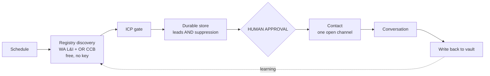

# Lead → conversation: the real pipeline

> [!danger] Read this before changing anything
> This describes what **runs**, not what was designed. Where the two differ, the
> running system is recorded and the design is marked as aspiration. Every claim
> here has evidence attached; anything unverified says so.
>
> **Zero prospect conversations have ever completed end-to-end.** That is the
> only number this document exists to change.

---

## 1. The map as it exists today

### Trigger
`schedule` in `app/worker.py` → `run_lead_hunt_slow_lane()`, **hourly**, capped at
`MAX_RUNS_PER_DAY = 10` (hard-coded, not env-tunable). Counters are module
globals with **no persistence** — every restart re-arms the wallet cap.

> [!bug] Undiscussed consequence
> 10 runs × hourly = hunting stops around **10:00 PST and stays off for 14
> hours** — the entire US business day. Nobody chose this; it fell out of two
> independent constants.

### Steps, in the order they actually execute

| # | Step | Reality |
|---|---|---|
| 1 | `TARGET_NICHE` env override | **Wins over the curated rotation.** Production is hunting `Automotive California` despite automotive being removed from the code list on 2026-08-02 (#126). The code fix edits a list production never reads. |
| 2 | `find_leads_v3()` source waterfall | See below — all four tiers |
| 2a | WA L&I licence registry | Gated `state == "WA"`. `_infer_state_from_query` matches only literal state names. **0 of 12 default niches can reach it.** |
| 2b | Yelp Fusion (#125) | `YELP_API_KEY not set — Yelp discovery skipped` |
| 2c | SerpAPI Maps | `429`. 0/250, renews **2026-08-04** (rolling from signup, not the 1st) |
| 2d | Legacy Maps scrape / DuckDuckGo | Fires only when 2c produced nothing. The code's own comment: URL-only leads, "cannot be called until re-enriched" |
| 3 | `enrich_lead_lite()` | `_crawl_semaphore` binds permanently to the first event loop that contends it; `gather(return_exceptions=True)` **silently discards** the error. Enrichment returns leads with no contact data and logs nothing. |
| 4 | Dossier build (AI call per lead) | Runs before we know the lead matters |
| 5 | ICP gate (`lead_validator`) | **Working.** Live-rejected `Keith's Auto Repair` and 3× `Acme Remodeling Co` fixture |
| 6 | `save_lead()` | Dedup index treated `""` email as an identity → **1 of 5 leads saved**. Pool poisoning on the except path. Both fixed in #129, **unmerged** |
| 7 | Event log | `no such table: events` — `reset_sqlite_fresh()` destroys it and only the restore-*success* branch rebuilt it. Fixed in #129, **unmerged** |
| 8 | Drip enrolment (`cold_intro_drip`) | Enrols leads **with no email address** into a cold-email sequence |
| 9 | Outreach email | Blocked fail-closed: `BUSINESS_POSTAL_ADDRESS` unset |
| 10 | Phone-first lane | Merged, inert, **legally shelved** (see ADR below) |
| 11 | Telegram report | Was unconditional; debounced in #126 |
| 12 | Durability | Drive `invalid_grant` → Sheets fallback, **leads only** |

### Where it stalls

Everything downstream of step 2 is moot, because **step 2 returns zero leads**.
Live production evidence, 09:13:11 UTC 2026-08-03:

```
🕵️ [SLOW LANE] Hunting for leads: Automotive California
[YELP] YELP_API_KEY not set — Yelp discovery skipped.
[SERPMAPS] SerpAPI status 429 for 'Automotive California'
[V3] Found 0 unique leads to enrich
```

---

## 2. What gets DELETED, and why

> [!important] Deleting a step beats automating it
> Each of these is removed because it should not exist — not because it is
> broken and awaiting a fix.

| Deleted | Why |
|---|---|
| **Step 8 — drip enrolment in the hunt lane** | It enrols leads that have **no email** into a cold-email sequence that is ToS-prohibited (AgentMail ToS §10 bans "unsolicited messaging"), has no valid addresses to send to, and is blocked fail-closed anyway. It burns cycles, writes rows, and creates the impression of an active channel. Delete the branch, not the capability — solicited follow-up still needs `send_outreach`. |
| **Step 2c — SerpAPI tier** | The only paid dependency in discovery. 250/month against registries that give **more** (owner name, which SerpAPI never returns) for **free and unlimited**. It is a cost and a quota-exhaustion failure mode bought in exchange for worse data. |
| **Step 2d — legacy scrape / DuckDuckGo fallback** | The code itself documents that it produces URL-only leads which "cannot be called until re-enriched" and whose `state` resolves to `""`, routing owner lookup to a dead branch. It does not produce leads; it produces rows that pollute the pipeline and dilute every count. |
| **Step 4 — dossier build at hunt time** | An AI call per lead, spent before the ICP gate has ruled and long before anyone is contacted. Moves to just-in-time, immediately before a human-approved contact. Most leads never get contacted, so most of this spend is pure waste. |
| **`is_dnc_registered()` as a "control"** | Not deleted — **demoted honestly**. It fails open, is unconfigured, and no provider exists at $0. It currently reads like a compliance gate in the code and is not one. Keep the function; stop counting it as protection. |

### What remains — the simplified sequence



Seven steps, down from twelve. The deletions remove **all paid dependencies**
and every branch that cannot terminate in a conversation.

---

## 3. What is verifiably live

> [!warning] Presence vs behaviour
> Credential **presence** was checked in the local `.env`. That is NOT
> production — `TARGET_NICHE` is absent locally yet production demonstrably
> uses it, and `GOOGLE_CREDENTIALS_JSON` is absent locally yet Sheets works in
> production. Only **behaviour** observed against production is authoritative.

| Tool | Status | Evidence |
|---|---|---|
| **WA L&I registry** | ✅ **LIVE** | Direct curl 2026-08-03 returned real ACTIVE contractor rows with phone. Free, no key, no quota. ~100% phone fill on a 200-row sample |
| **OR CCB registry** | ✅ **LIVE, unused** | Direct curl returned real rows. 30,275 contractor records, ~99.97% phone fill. **Zero code references it** |
| **Retell** | ✅ **CREDENTIALS LIVE** | `list_agents` + `list_calls` returned real data. Inbound agent `Nova — Inbound (callback)` exists and is well-built |
| **Google Sheets** | ✅ **LIVE** | `[DURABILITY:hunt] Sheets fallback: 1/1 leads synced` in production |
| **Google Drive** | ❌ **DEAD** | `invalid_grant: Token has been expired or revoked`, observed live 09:37:53 |
| **SerpAPI** | ❌ **EXHAUSTED** | Account API: `total_searches_left: 0`, `"Your account has run out of searches"` |
| **Yelp** | ❌ **NO KEY** | `[YELP] YELP_API_KEY not set` in production logs |
| **AgentMail** | ⚠️ **KEY PRESENT, CHANNEL CLOSED** | Cold email prohibited by their ToS §10; no valid addresses exist; CAN-SPAM gate fail-closed on unset `BUSINESS_POSTAL_ADDRESS` |
| **Booking link** | ❌ **UNSET** | All three of `CAL_COM_EVENT_SLUG` / `CALENDLY_LINK` / `GOOGLE_CALENDAR_BOOKING_LINK` absent |
| **Instagram** | ✅ **ACCOUNT READY** | `account_type: BUSINESS`, 11 posts, 201 followers. DM #1 cannot be API-initiated |

### The real blockers, named plainly

1. **`DASHBOARD_API_KEY` is published on a PUBLIC repo** — in 7 tracked files and 24 commits. Owner must rotate.
2. **The suppression list is destroyed on every container recycle** and nothing says so — see §6.
3. **No booking link** — a hot reply on any channel has nowhere to land.
4. **No discovery source can fire for California**, the #1 ICP geography.

---

## 4. The one agent this workflow needs

Not five. The workflow has exactly one job that requires judgement rather than
code, and it sits at the only place a conversation can actually begin.

> [!info] **Conversation Closer**
> **One sentence:** Takes an inbound prospect reply — Instagram DM, inbound
> call, or a reply to solicited follow-up — and turns it into either a booked
> meeting or a recorded disqualification.
>
> **Input:** one inbound message or call transcript, plus that prospect's row
> and prior event history.
>
> **Output:** exactly one of —
> - a drafted reply, queued for approval;
> - a booking proposal (slot + link), queued for approval;
> - a disqualification with a reason written to the event log;
> - an opt-out, written to the suppression list **immediately**.
>
> **Tools:** read the prospect row and event log · read the vault (ADR-0012
> ICP, ADR-0013 positioning) · read Cal.com availability · write to the event
> log · write to the suppression list. **It cannot send anything.**
>
> **Approval points:** every outbound message, every booking, without exception.
> The agent drafts; a human sends.

**Why not a "lead qualifier" agent:** qualification is already deterministic
code (`score_lead_icp`, `lead_validator`) and it demonstrably works — it
live-rejected an auto-repair shop and three fixture rows. Wrapping working
deterministic logic in an LLM would make it slower, dearer and less
predictable. **Don't build it.**

**Why not a "cold outreach drafter":** there is no open cold channel. Building
it would be automating a step that cannot run.

---

## 5. Automation contract

Nothing here is enabled until Phases 1–4 are real.

| | Reversible — may run alone | Irreversible — **APPROVAL REQUIRED** |
|---|---|---|
| **Actions** | registry discovery · ICP scoring · durable storage · enrichment · writing to the vault and event log | **sending any email** · **placing any call** · **sending any DM** · **booking any meeting** · **spending money** · **publishing anything public** |

For each automated step:

- **Trigger** — named schedule or named event. No implicit triggers.
- **Permission** — an explicit allowlist. Anything not listed is denied.
- **Logs** — the event log records what happened and why, not just pass/fail.
  This is currently **broken**: the `events` table does not exist in
  production. Automation cannot be trusted until it does.
- **Failure path** — every gate fails **closed**. A lookup error blocks; it
  never proceeds.
- **Pause button** — `CALLS_AUTOPILOT=0` / `OUTREACH_AUTOPILOT=0` in Render,
  effective on the next lane tick.

> [!danger] Hard rule — not subject to optimisation
> Anything a real person receives waits for an explicit human yes. Slower is
> the accepted cost. This does not get relaxed for velocity, for a demo, or
> because a queue is backing up.

---

## 6. Exceptions — the cases that break the normal rule

| Exception | What happens instead |
|---|---|
| **Lead has no email** (every registry lead) | Normal rule routes to email. Instead: it must never enter an email sequence. #124 blocks guessed addresses; the drip branch is deleted (§2) |
| **Opt-out received** | Bypasses every queue and every approval. Written immediately, no batching, no review. Suppression is the one write that never waits |
| **Suppression list read returns empty** | **Currently indistinguishable from "nobody opted out"** — the list is wiped on every container recycle and `get_state(key, [])` returns `[]` *successfully*, so fail-closed never triggers. Until this is fixed, treat every cold boot as having erased the opt-out list |
| **Exotic/luxury auto lead** | ADR-0012 keeps it opportunistic, not excluded — the ICP gate exempts it by business name. But it is no longer hunted |
| **Phone number in non-E.164 form** | Canonicalised to E.164 on both write and read (#130). Unresolvable input fails **closed** — blocked, not dialled |

---

## 7. Decisions carried here with their reasoning

Recorded so a future session cannot silently re-litigate them.

- **Sheets over Drive as the durable tier.** Not preference — Drive's OAuth
  token dies every 7 days (consent screen is External+Testing, a documented
  Google behaviour), and the "use a service account instead" fix is **wrong**:
  service accounts have no Drive storage quota and cannot own files. Sheets
  works with the same service-account credential because the spreadsheet is
  owned by a real user and merely shared. That asymmetry is the whole reason.
- **The phone lane is shelved, not paused.** FCC 24-17 forecloses a live-agent
  carve-out, and the soundboard precedent — a *live human* picking clips in
  real time, held to be a prerecorded voice — settles that interactivity is
  legally irrelevant. §227(b)(1)(A)(iii) has no available B2B exemption.
  **Do not buy the lawyer hour; the answer is no.**
- **Cold email is deferred by ToS, not by deliverability.** The `550 5.4.1`
  bounces were invalid recipients, not reputation. A shared domain *can* pass
  auth. The blocker is AgentMail ToS §10 plus the absence of any valid address.
- **`app/config.py` was deleted in favour of boot-time capability validation.**
  Typing would not have caught the failures that actually happened — those were
  config that *silently did nothing*, not config that was mistyped.
- **Compliance gates are never weakened for speed.** Standing owner mandate.

---

---

## 8. Update 2026-08-04 — California is open, and three claims were wrong

### CSLB is live and free — California no longer needs Yelp

Downloaded a real file through the CSLB Public Data Portal: **236 B-2
Residential Remodeling contractors in Los Angeles County**, `.xlsx`, free, no
signup, no API key.

| Field | Reality |
|---|---|
| `PhoneNumber` | **100% fill** (236/236). Format `(323) 470 1937` — NOT E.164 |
| `BusinessName`, `Address`, `City`, `County`, `ZIP` | full |
| `Classification(s)` | present — e.g. `B-2 \| C36`. WA L&I has no category field at all |
| `BusinessType` | Corporation 109 · **Sole Owner 103** · Limited Liability 24 |
| `WorkersCompCoverageType` | **blank on 224 of 236** — unusable as a filter |
| Owner / principal name | **ABSENT.** Unlike WA L&I and OR CCB |
| Email | absent, and stated as policy (B&P Code §27) |

**Query size is the constraint, not access.** One classification in one county
= 236 rows. The owner's original 8 classifications × 10 counties returned an F5
rejection and a `504 Gateway Timeout` — the form builds results synchronously.
**Pull one classification × one county at a time.**

### Three corrections

1. **Yelp is not a free tier.** It is now the *Yelp Places API*: self-serve
   gives a **30-day trial**, richer APIs are partner-only. The vault's "free via
   Composio, no key, no approval" was true of **Composio's** credential, which
   does not transfer to Nova's runtime. **PR #125 is dormant unless paid for.**
2. **`BusinessType` is not a size or affordability signal.** It is a tax filing
   status. A sole proprietorship can carry ten W-2 employees; incorporating in
   construction is usually a *liability* decision, not a growth milestone. An
   earlier draft of this runbook reasoned from that field to "sole owners can't
   afford the retainer" — that is wrong, and it contradicts ADR-0012 directly:
   *"the filter is a deal-size ratio, not affordability."* A B-2 remodeler in LA
   runs $50–150K jobs; one extra job covers months of retainer at any legal
   structure.
3. **SerpAPI renewed 2026-08-04** — 243 searches left, next renewal 2026-09-04.
   Renewal is **rolling from signup**, not calendar month. It is a 243/month
   budget for everything, so it cannot be spent one-search-per-lead across a
   whole county.

### What CSLB does NOT give, and what that blocks

- **No owner name.** WA L&I and OR CCB both supply the principal; California
  does not. `owner_finder` routes CA to CALICO, gated behind `CA_SOS_API_KEY`,
  **requested 2026-07-23, no reply**. So CA leads arrive nameless.
- **No Instagram handle.** Nothing in the pipeline resolves a business name to
  an IG profile. The existing scheduled task
  ([[ig-reply-agent-scheduled-task-prompt]]) is a **reply** agent — it answers
  threads the owner already opened. It cannot discover profiles and cannot
  initiate. That capability does not exist yet.

### Consequence for the Retell outbound prompt

`outbound_dialer` passes `name` / `full_name` dynamic variables from the lead's
owner field. **CSLB leads have no owner**, so `name` degrades to `"there"` and
`full_name` renders empty. The outbound prompt needs a no-name path before any
California lead is ever dialled — separately from the fact that the phone lane
is legally shelved (§7).

---

## Linked
[[active-context]] · [[0012-icp-rerank-and-pilot-pricing]] ·
[[0013-painkiller-positioning-and-real-competition]] ·
[[0014-licence-registries-as-the-discovery-source]] ·
[[instagram-outreach-plan-2026-07-30]]
